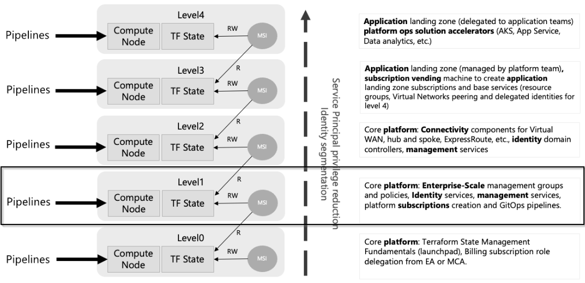
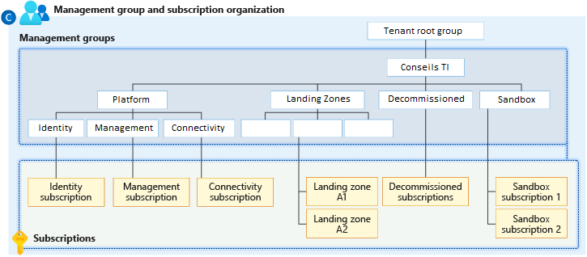

## Requirements

| Name | Version |
|------|---------|
| <a name="requirement_terraform"></a> [terraform](#requirement\_terraform) | >= 1.6.0 |
| <a name="requirement_azurerm"></a> [azurerm](#requirement\_azurerm) | ~> 4.64.0 |

## Providers

| Name | Version |
|------|---------|
| <a name="provider_azurerm"></a> [azurerm](#provider\_azurerm) | ~> 4.64.0 |

## Modules

| Name | Source | Version |
|------|--------|---------|
| <a name="module_subscriptions"></a> [subscriptions](#module\_subscriptions) | ./modules/landing_zone_subscription | n/a |

## Resources

| Name | Type |
|------|------|
| [azurerm_management_group.level_1](https://registry.terraform.io/providers/hashicorp/azurerm/latest/docs/resources/management_group) | resource |
| [azurerm_management_group.level_2](https://registry.terraform.io/providers/hashicorp/azurerm/latest/docs/resources/management_group) | resource |
| [azurerm_management_group.level_3](https://registry.terraform.io/providers/hashicorp/azurerm/latest/docs/resources/management_group) | resource |
| [azurerm_management_group.level_4](https://registry.terraform.io/providers/hashicorp/azurerm/latest/docs/resources/management_group) | resource |
| [azurerm_management_group.level_5](https://registry.terraform.io/providers/hashicorp/azurerm/latest/docs/resources/management_group) | resource |
| [azurerm_management_group.level_6](https://registry.terraform.io/providers/hashicorp/azurerm/latest/docs/resources/management_group) | resource |

## Inputs

| Name | Description | Type | Default | Required |
|------|-------------|------|---------|:--------:|
| <a name="input_billing_scope_id"></a> [billing\_scope\_id](#input\_billing\_scope\_id) | (Required) The Billing Scope ID for the Microsoft Customer Agreement (MCA) where the subscriptions will be created. | `string` | n/a | yes |
| <a name="input_root_name"></a> [root\_name](#input\_root\_name) | (Required) Will set a custom Display Name value for the Enterprise-scale root Management Group. | `string` | n/a | yes |
| <a name="input_root_parent_id"></a> [root\_parent\_id](#input\_root\_parent\_id) | (Required) The root\_parent\_id is used to specify where to set the root for all Landing Zone deployments. Usually the Tenant ID when deploying the core Enterprise-scale Landing Zones. | `string` | n/a | yes |
| <a name="input_subscription_id"></a> [subscription\_id](#input\_subscription\_id) | (Required) Azure Subscription ID for the provider to authenticate against. | `string` | n/a | yes |
| <a name="input_tenant_id"></a> [tenant\_id](#input\_tenant\_id) | (Required) Azure Tenant ID for the provider to authenticate against. | `string` | n/a | yes |

## Outputs

| Name | Description |
|------|-------------|
| <a name="output_azurerm_management_group"></a> [azurerm\_management\_group](#output\_azurerm\_management\_group) | Returns the configuration data for all Management Groups created. |
| <a name="output_subscriptions"></a> [subscriptions](#output\_subscriptions) | Returns the map of all provisioned subscriptions including their IDs, display names, and associated Management Groups. Useful for secondary workspaces to configure SPNs and Policies. |

<!-- BEGIN_TF_DOCS -->
<!-- markdownlint-disable MD033 -->
# Azure Management Groups and Subscriptions

This project is responsible for provisioning the core Azure Management Groups and baseline Subscriptions required for the Landing Zone.
It defines the core platform Enterprise-scale management groups and hierarchy according to the Cloud Adoption Framework (CAF) and automatically provisions and associates required workload subscriptions (Identity, Management, Connectivity) to their respective management groups.

## Cloud Adoption Framework - Level 1: Core Platform

This repository focuses on **Level 1** of the Cloud Adoption Framework (CAF), provisioning the **Core platform: Enterprise-Scale management groups, Identity, and Subscriptions**.

Due to technical limitations and state management considerations within Terraform, the configuration of Azure Policies and identity access (Service Principals/RBAC) has been split from this codebase into dedicated repositories. This workspace cleanly exposes the necessary subscription outputs for those downstream repositories to consume.



## Management Group Structure

The following diagram illustrates the specific Management Group hierarchy provisioned by this Terraform configuration.



## Permissions

The following permissions are required to apply this configuration:

- **Azure Management Groups**: `Management Group Contributor` or `Owner` on the Tenant Root Management Group.
- **Azure Subscriptions (Billing)**: `Azure subscription creator` role.
  - **Important Note**: This is an Azure *Billing* role, not a standard Azure RBAC role.
  - For a Microsoft Customer Agreement (MCA), this role must be assigned at the **Invoice Section** scope corresponding to the `billing_scope_id` variable.
  - **How to assign via Azure Portal**: Navigate to **Cost Management + Billing** > Select your Billing Scope > **Billing profiles** > Select your profile > **Invoice sections** > Select your invoice section > **Access control (IAM)** > Add the `Azure subscription creator` role to the Service Principal or User running this Terraform configuration.

## Authentications

Authentication to Azure can be configured using one of the following methods, with Dynamic Provider Credentials (OIDC) being the recommended approach for automation.

### Dynamic Provider Credentials (OIDC) - Preferred

Use OIDC for secure, passwordless authentication from your CI/CD pipelines (e.g., HCP Terraform Workspaces, GitHub Actions, GitLab CI).

- **Inside the provider block**

  ```hcl
  provider "azurerm" {
    features {}
    
    subscription_id = var.subscription_id
    tenant_id       = var.tenant_id

    use_oidc = true
    use_cli  = false
  }
  ```

- **Using HCP Terraform Workspace variables**
  - `TFC_AZURE_PROVIDER_AUTH=true`
  - `TFC_AZURE_RUN_CLIENT_ID`

### Service Principal and Client Secret

Use an Azure AD service principal for non-interactive runs if OIDC is unavailable.

- **Inside the provider block**

  ```hcl
  provider "azurerm" {
    features {}
    
    subscription_id = "<subscription-id>"
    tenant_id       = "<tenant-id>"
    client_id       = "<client-id>"
    client_secret   = "<client-secret>"
  }
  ```

- **Using environment variables**
  - `ARM_SUBSCRIPTION_ID`
  - `ARM_TENANT_ID`
  - `ARM_CLIENT_ID`
  - `ARM_CLIENT_SECRET`

Documentation:

- [Authenticating to Azure](https://registry.terraform.io/providers/hashicorp/azurerm/latest/docs#authenticating-to-azure)
- [Dynamic Provider Credentials (OIDC)](https://registry.terraform.io/providers/hashicorp/azurerm/latest/docs/guides/service_principal_oidc)
- [HCP Terraform Dynamic Credentials with Azure](https://developer.hashicorp.com/terraform/cloud-docs/workspaces/dynamic-provider-credentials/azure-configuration)

## Features

- Manages up to 6 levels of Azure Management Group hierarchies dynamically.
- Automatically handles dependencies between parent and child management groups through local variable evaluation.
- Dynamically provisions new Azure Subscriptions for core workloads (e.g., Identity, Management, Connectivity) using MCA Billing Scope IDs.
- Automatically associates provisioned subscriptions to their respective Management Groups.

## Documentation

## Requirements

The following requirements are needed by this module:

- <a name="requirement_terraform"></a> [terraform](#requirement\_terraform) (>= 1.6.0)

- <a name="requirement_azurerm"></a> [azurerm](#requirement\_azurerm) (~> 4.64.0)

## Modules

The following Modules are called:

### <a name="module_subscriptions"></a> [subscriptions](#module\_subscriptions)

Source: ./modules/subscription

Version:

## Required Inputs

The following input variables are required:

### <a name="input_billing_scope_id"></a> [billing\_scope\_id](#input\_billing\_scope\_id)

Description: (Required) The Billing Scope ID for the Microsoft Customer Agreement (MCA) where the subscriptions will be created.

Type: `string`

### <a name="input_root_name"></a> [root\_name](#input\_root\_name)

Description: (Required) Will set a custom Display Name value for the Enterprise-scale root Management Group.

Type: `string`

### <a name="input_root_parent_id"></a> [root\_parent\_id](#input\_root\_parent\_id)

Description: (Required) The root\_parent\_id is used to specify where to set the root for all Landing Zone deployments. Usually the Tenant ID when deploying the core Enterprise-scale Landing Zones.

Type: `string`

### <a name="input_subscription_id"></a> [subscription\_id](#input\_subscription\_id)

Description: (Required) Azure Subscription ID for the provider to authenticate against.

Type: `string`

### <a name="input_tenant_id"></a> [tenant\_id](#input\_tenant\_id)

Description: (Required) Azure Tenant ID for the provider to authenticate against.

Type: `string`

## Optional Inputs

No optional inputs.

## Resources

The following resources are used by this module:

- [azurerm_management_group.level_1](https://registry.terraform.io/providers/hashicorp/azurerm/latest/docs/resources/management_group) (resource)
- [azurerm_management_group.level_2](https://registry.terraform.io/providers/hashicorp/azurerm/latest/docs/resources/management_group) (resource)
- [azurerm_management_group.level_3](https://registry.terraform.io/providers/hashicorp/azurerm/latest/docs/resources/management_group) (resource)
- [azurerm_management_group.level_4](https://registry.terraform.io/providers/hashicorp/azurerm/latest/docs/resources/management_group) (resource)
- [azurerm_management_group.level_5](https://registry.terraform.io/providers/hashicorp/azurerm/latest/docs/resources/management_group) (resource)
- [azurerm_management_group.level_6](https://registry.terraform.io/providers/hashicorp/azurerm/latest/docs/resources/management_group) (resource)

## Outputs

The following outputs are exported:

### <a name="output_azurerm_management_group"></a> [azurerm\_management\_group](#output\_azurerm\_management\_group)

Description: Returns the configuration data for all Management Groups created.

### <a name="output_subscriptions"></a> [subscriptions](#output\_subscriptions)

Description: Returns the map of all provisioned subscriptions including their IDs, display names, and associated Management Groups. Useful for secondary workspaces to configure SPNs and Policies.

<!-- markdownlint-enable -->
<!-- markdownlint-disable MD041 -->
## External Documentation

- [Azure Landing Zones - Management group and subscription organization](https://learn.microsoft.com/en-us/azure/cloud-adoption-framework/ready/landing-zone/design-areas/management-group-and-subscription-organization)
- [Terraform Provider for AzureRM - azurerm\_management\_group](https://registry.terraform.io/providers/hashicorp/azurerm/latest/docs/resources/management_group)
<!-- END_TF_DOCS -->